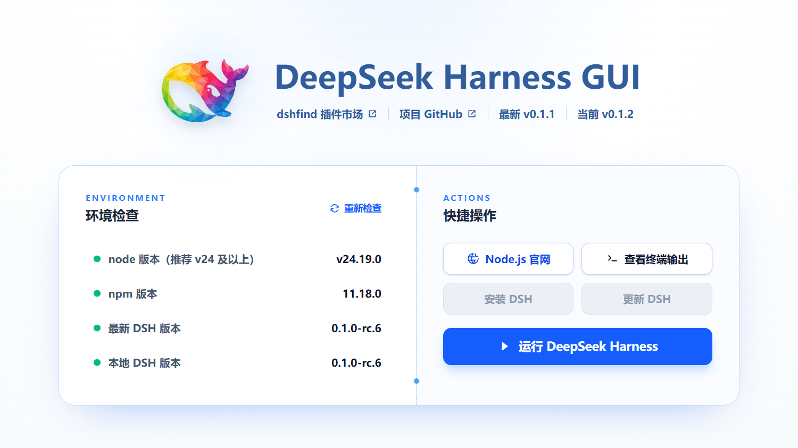

# DeepSeek Harness GUI



## 安装

- 环境准备：目前只支持 Windows 系统，需安装 [Node.js](https://nodejs.org/zh-cn/download)
- 前往 [**Release**](https://github.com/festoney8/deepseek-harness-GUI/releases/) 下载安装包，setup 是安装版，portable 是便携版

## 介绍

- 本项目是基于 Tauri 构建的 [deepseek-harness](https://github.com/deepseek-ai/deepseek-harness) 轻量启动器，保留原始 DSH 功能，提供桌面版 APP 体验
- 已适配文件下载、图片拖拽、剪贴板等操作，支持将应用最小化到通知栏
- 本项目使用 worker 模式管理 DSH，支持在应用中安装/更新 DSH

## 日志

- 日志目录 `C:\Users\<用户名>\AppData\Local\deepseek-harness-gui\logs`，可用于检查运行问题。
- 启动运行时会用当前时间戳创建文件夹，过期日志会自动清理。

## 自行构建

### 环境依赖

- windows 环境
- node.js >= v24.0
- pnpm
- 系统应支持 webview2

### 常用命令

```shell
# clone 项目
git clone https://github.com/festoney8/deepseek-harness-GUI
cd deepseek-harness-GUI

# 安装依赖
pnpm i

# 开发模式
pnpm tauri dev

# 构建安装包，产物路径 src-tauri\target\release\bundle\nsis
pnpm build:installer

# 构建便携版，产物路径 src-tauri\target\release\bundle\portable
pnpm build:portable
```
